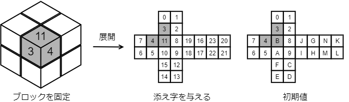
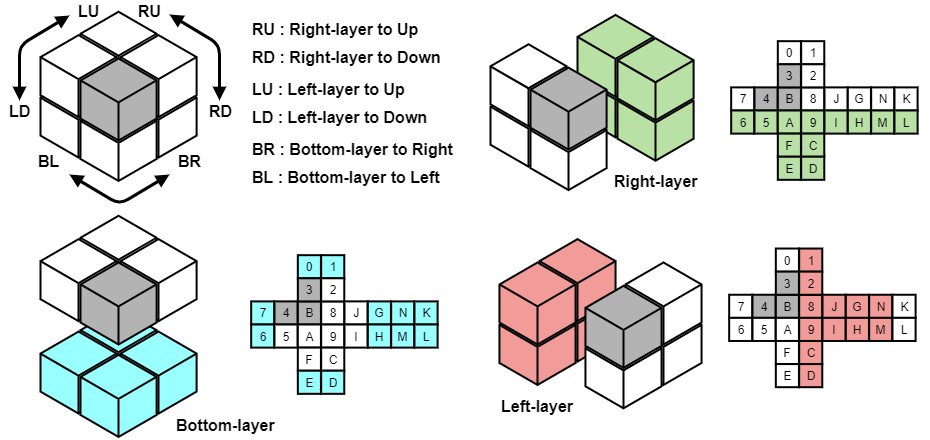

# Pocket-Cube

ポケットキューブを解く最短手順を A* アルゴリズムで探索するプログラムです．
かなり力任せの探索を行うため，あまり高速ではありません．

## ポケットキューブについて

ポケットキューブは，ルービックキューブより小さな $2 \times 2 \times 2$ の立方体パズルです．
パズルが取り得る状態数は全部で $3,674,160$，最大手数は $90^{\circ}$ 回転を１手とした場合に $14$ 手です．

全状態のうち，最短手数が $10 \sim 12$ の状態が高いボリュームゾーンとなっており，約 $3,000,000$ 通り（約 $83\%$）を占めています．

そのため，貧弱なアルゴリズムを用いて**最短手数が $\bold{10}$ 手以上の状態から解き始めると，非常に長い探索時間が掛かる可能性があります．**

## 当プログラムについて

当プログラムでは，A*アルゴリズムを用いてポケットキューブを解く最短手順を探索しています．

ヒューリスティック関数として，ゴールとなる状態(キューブの全面が揃っている状態)における各マスの位置を基準に，何回転分離れているのかを計算してゴールまでのコストを推定します．

各マスの初期位置(番号)は次の図中「初期値」のように与えられます．

そして，ひとつのブロックを固定して考えることで，ポケットキューブにおけるすべての操作は次の図の通り「６つ」で表現可能です．

上の図を参考に，当プログラムで利用しているヒューリスティック関数からコストを計算してみます．

初期状態(ゴールの状態)に操作 "<code>RU</code>" を加えたとき，図右上の緑色で塗られた12個のマスが１回転分だけ初期位置から移動していることになるため，ゴールまでのコストは「$12$」となります．

また，各マスは最大でも４回転分しか初期位置から離れることができないため，キューブの状態が取り得る最大のコストは $4~[cost] \times 24~[square] = 96$ となります． 

## プログラムの使用方法

### コンパイルと実行
例えば，次のようにコンパイルした後，任意のパラメータを与えて実行して下さい．
~~~
Pocket-Cube$ gcc pocket_cube.c -O3 -lm
Pocket-Cube$ ./a.out <rotate> <seed>
~~~
- <code>\<rotate\></code>：ランダムに回転させる回数（任意）．未指定の場合はランダムに数字が選ばれます．
- <code>\<seed\></code>：乱数生成器のシード（任意）．指定することで実行結果の再現性が得られます．

### 出力結果例
以下は，<code>\<rotate\></code> に <code>14</code> を与えたときの実行結果です．
~~~
[Pocket-Cube]:$ time ./a.out 14
seed: 1648654218
rotate: 14
[GOAL]->LU->BL->RU->BR->BR->BR->BL->LD->BL->LD->LD->RD->RU->RU->[START]
        [0][L]
        [3][G]
  [7][4][B][N][1][E][6][K]
  [F][H][M][C][9][J][8][A]
        [D][I]
        [5][2]
Loop: 12151/ size: 36830/ node: 48981/ miss: 40237/ extend:    0
steps: 10
        [0][1]
        [3][2]
  [7][4][B][8][J][G][N][K]
  [6][5][A][9][I][H][M][L]
        [F][C]
        [E][D]
[GOAL]<-BL<-LU<-BR<-LD<-LD<-BR<-RD<-BL<-LD<-RD<-[START]
SUCCEED!

real    0m34.777s
user    0m34.754s
sys     0m0.020s
~~~

また，同じランダムシード（<code>\<rotate\></code>の値）を指定することで，同じ実行結果を再現することが可能です．
~~~
[Pocket-Cube]:$ time ./a.out 14 1648654218
seed: 1648654218
rotate: 14
[GOAL]->LU->BL->RU->BR->BR->BR->BL->LD->BL->LD->LD->RD->RU->RU->[START]
        [0][L]
        [3][G]
  [7][4][B][N][1][E][6][K]
  [F][H][M][C][9][J][8][A]
        [D][I]
        [5][2]
Loop: 12151/ size: 36830/ node: 48981/ miss: 40237/ extend:    0
steps: 10
        [0][1]
        [3][2]
  [7][4][B][8][J][G][N][K]
  [6][5][A][9][I][H][M][L]
        [F][C]
        [E][D]
[GOAL]<-BL<-LU<-BR<-LD<-LD<-BR<-RD<-BL<-LD<-RD<-[START]
SUCCEED!

real    0m35.088s
user    0m35.051s
sys     0m0.030s
~~~

上記の例で分かる通り，このプログラムでは最短手数が $10$ 手以上の初期状態を与えらえると，探索に長い時間が掛かってしまう場合があります（過去に $12$ 手の初期状態を与えた場合に $2$ 時間以上の探索時間を要した経験があります）．

---
## License
This source code is under the MIT License, see LICENSE.
